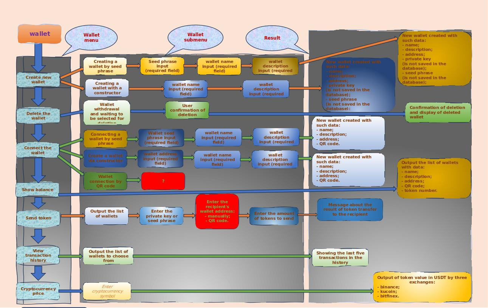
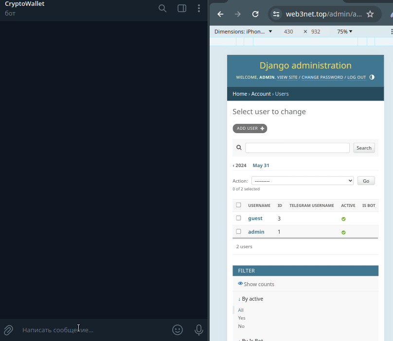
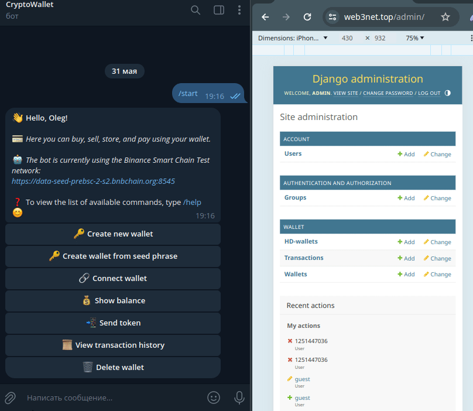
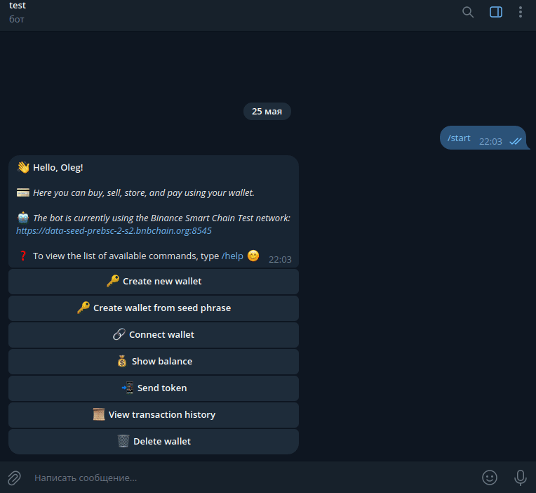
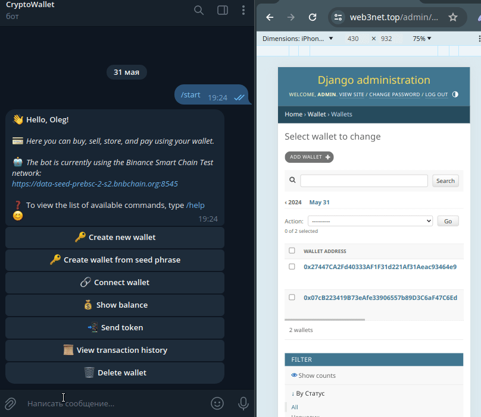
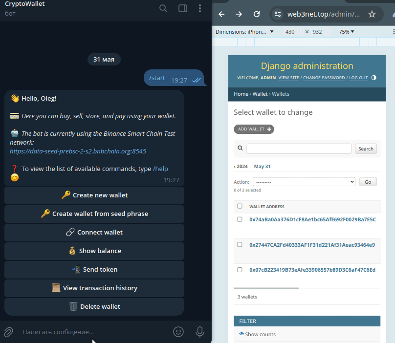

# Telegram Wallet

This project is a full-featured Telegram bot for interacting with Binance Smart Chain (BSC) wallets. The main goal is to provide a
convenient and secure interface for creating, managing, and performing operations with BSC wallets directly from
Telegram.

# Presentation for Hackathon: Test Version of Cryptocurrency Wallet as a Telegram Bot on Binance Smart Chain

[](https://www.youtube-nocookie.com/embed/aJerkcnH2fc)

---

## Introduction

### Project
- Cryptocurrency wallet as a Telegram bot on Binance Smart Chain

### Goal
- Provide a convenient, secure, and fast way to manage cryptocurrencies through Telegram
---

## Team

### Team Name
- Web3k Wallet project

---

## Main Features of the Wallet Bot

### Secure Storage of Cryptocurrencies
- Supports the main cryptocurrency BNB on the BSC platform.
- Working with cryptocurrencies in the main popular blockchains (now Binance Smart Chain and Solana)
- Reliable encryption and user data protection

### Ease of Use
- Intuitive interface in Telegram
- Quick setup and access through bot commands

### Instant Transactions
- High transaction speed due to the power of the BSC network
- Low transaction fees

---

## Unique Advantages

### High Level of Security
- Use of modern cryptographic methods
- Multi-level protection against unauthorized access

### Decentralized Nature
- No central governing body
- Transparency of all operations on the blockchain

---

## How to Start Using the Wallet Bot on BSC?

### Step 1: Adding the Bot in Telegram
- Find and add the bot through the search in Telegram
- Official bot name (CryptoWallet): @o5boot_bot
- Telegram link: https://t.me/o5boot_bot

### Step 2: Registration and Setup
- Launch the bot and follow the instructions to create a new wallet or import an existing one
- Set up security measures

### Step 3: Funding the Account
- Purchase cryptocurrency through exchange services
- Transfer cryptocurrency from other wallets to the address provided by the bot

### Step 4: Making Transactions
- Send and receive cryptocurrencies through bot commands
- Use funds to pay for services and products in dApps

---

## Current Development Status

### Test Version
- Basic wallet functions implemented and tested on Binance Smart Chain Testnet
- Access open for initial users and testers

### Future Plans
- Adding new features and improvements based on feedback
- Integration with more dApps
- Expanding security and data protection capabilities


---

## Prospects and Future Development

### Expanding Functionality
- New tools and opportunities for users and developers

### Community Support
- Active user participation in platform development
- Regular updates and improvements based on feedback

### Growth of the BSC Ecosystem
- Increasing the number of dApps and services operating on the platform
- Expanding opportunities for interaction and use of cryptocurrencies

---

## Conclusion

### Why Choose a Wallet Bot on the BSC Blockchain?
- Modern technology and high security
- Transparency and decentralization
- Broad opportunities for financial transactions and participation in the BSC ecosystem

---

## Contacts and Resources

### Social Media and Communities

- Twitter: [Web3k Wallet](https://x.com/Web3k_wallet)

## Technical data

### User flowchart



### Binance Smart Chain wallet

- t.me/o5boot_bot
- @o5boot_bot
- Binance Smart Chain Test wallet uses a test node - https://data-seed-prebsc-2-s2.bnbchain.org:8545

## Installation

```bash
# clone the repository
https://github.com/o5b/telegram-crypto-wallet.git
cd telegram-crypto-wallet/
# install and activate the virtual environment
python3.12 -m venv venv
source venv/bin/activate
# insatll requirements
pip install -r requirements/base.txt
```

## Preparation before Use

Before running, you need to create and populate the .env settings file.

```bash
# create settings file
cp .env.example .env
```

You need to specify your token for accessing the Telegram API and the database engine in it.

- Create a bot via BotFather on Telegram and obtain the token for your bot.
- Make sure that your bot has polling mode enabled for updates.

Example `.env`:

```bash
# Settings for the token and list of administrators for the bot.
# BOT_TOKEN - token for accessing the Telegram API.
BOT_TOKEN=...your..telegram..bot..token...
# ADMIN_IDS - list of bot administrator IDs, separated by comma.
ADMIN_IDS=[173901673,124543434,143343455]

POSTGRES_USER=walletbot
POSTGRES_PASSWORD=walletbot
POSTGRES_DB=walletbot
POSTGRES_HOST=postgres
POSTGRES_PORT=5432

GUNICORN_PORT=8000
GUNICORN_WORKERS=2
GUNICORN_TIMEOUT=60
GUNICORN_LOG_LEVEL=info

# DJANGO_SETTINGS_MODULE=web.settings
DJANGO_SECRET_KEY='...your..django..secure..key...'
DJANGO_DEBUG=0
# DJANGO_ALLOWED_HOSTS=127.0.0.1,localhost
DJANGO_LANGUAGE_CODE=en-us
DJANGO_TIME_ZONE=UTC
DJANGO_CSRF_TRUSTED_ORIGINS=
DJANGO_EMAIL_HOST=localhost
DJANGO_EMAIL_PORT=25
DJANGO_EMAIL_HOST_USER=
DJANGO_EMAIL_HOST_PASSWORD=
# DJANGO_EMAIL_USE_TLS=false
DJANGO_SERVER_EMAIL=root@localhost
DJANGO_DEFAULT_FROM_EMAIL=webmaster@localhost
DJANGO_ADMIN_NAME=
DJANGO_ADMIN_EMAIL=
DJANGO_SUPERUSER_USERNAME=admin
DJANGO_SUPERUSER_PASSWORD=qwerty123
DJANGO_SUPERUSER_EMAIL=admin@example.com
```

For local run without docker DJANGO DEBUG in True

If `postgresql` is selected as the database, then you can run it in Docker.

### Running a container in docker `postgresql`

```bash
cd telegram-crypto-wallet/compose/
# start postgresql container:
docker compose -f postgres-docker-compose.yml up -d
# stop:
docker compose -f postgres-docker-compose.yml down -v
```

## Preparation Django

```bash
cd telegram-crypto-wallet/
# if not activated yet, then activate the virtual environment
source venv/bin/activate
python manage.py makemigrations
python manage.py migrate
python manage.py createsuperuser
```

### Running Django

```bash
cd telegram-crypto-wallet/
# if not activated yet, then activate the virtual environment
source venv/bin/activate
python manage.py runserver
```

Now you can login to the admin site: http://127.0.0.1:8000/admin/

### Running a bot

```bash
cd telegram-crypto-wallet/
# if not activated yet, then activate the virtual environment
source venv/bin/activate
python bot.py
```

## Run in docker

### Run locally

```bash
cd telegram-crypto-wallet/
# run
docker compose -f docker-compose.yml up -d
# stop
docker compose -f docker-compose.yml down -v
```

Now you can login to the admin site: http://127.0.0.1/admin/

### Run in production

You need to add your website domain to docker-compose-prod.yml

```bash
cd telegram-crypto-wallet/
# run
docker compose -f docker-compose-prod.yml up -d
# stop
docker compose -f docker-compose-prod.yml down -v
```

Now you can login to the admin site: https://your_domain/admin/

The database data will be stored in the parent folder of the project root folder.


## After run, the wallet will be available on Telegram

### New user registration



### Creating a new wallet



### Creating a new wallet from seed-phrase



### Connecting an existing wallet



### Send token



### Delete wallet


## Description of Functionality and Project Architecture

1. Creating a new Binance Smart Chain (BSC) wallet:
    - When selecting the "Create Wallet" option in the bot's main menu, the process of creating a new wallet
      begins.
    - The bot requests a name for the new wallet from the user, which must adhere to a specific pattern (only letters,
      numbers, spaces, and special characters: -_).
    - If the entered name is incorrect, the bot displays an error message and requests the name again.
    - After entering the correct name, the bot prompts the user to enter a description for the wallet (optional field).
      The description is also checked against a specific pattern (letters, numbers, spaces, and special characters:
      -_,.;:!?).
    - If the description is incorrect, the bot displays an error message and requests the description again.
    - The public key is the address of the new wallet, and the private key is required for transactions and should be
      securely stored by the user.
    - The bot saves the wallet address, name, description, and user association in the database (SQLite or PostgreSQL).
    - The bot sends the user the address of the new wallet, name, description, and private key.
2. Connecting an existing wallet:
    - When clicking the "Connect Wallet" button, the bot requests the user's address of an existing wallet.
    - The bot validates the entered address using the is_valid_wallet_address function from the bsc module.
    - If the address is invalid, the bot displays an error message and requests the address again.
    - The bot checks if this address has already been connected to the user's account.
    - If the address is already connected, the bot displays a corresponding message and requests another address.
    - If the address has not yet been connected, the bot requests a name and description for the wallet being connected
      from the user.
    - The name and description are checked against established patterns, as with creating a new wallet.
    - After successfully entering all the data, the bot saves the wallet address, name, description, and user
      association in the database.
    - The bot sends the user a message about the successful connection of the wallet.
3. Checking the balance:
    - When selecting the "Show Balance" option, the bot retrieves a list of all the user's connected wallets from the
      database.
    - For each wallet, the bot requests the current BNB balance from the BSC network using the get_bnb_balance
      function from the bsc module.
    - Wallet balances are cached in the wallet_balances_cache dictionary for performance improvement and reducing load
      on BSC network nodes.
    - The bot formats a message with information about each wallet (name, address, balance) and sends it to the user.
4. Send tokens:
    - When selecting the "Send tokens" option, the user receives a list of their connected wallets in the form of an
      inline keyboard using the get_wallet_keyboard function from the transfer_transaction_keyboards module.
    - After selecting the sender wallet from the list, the bot requests the user to enter the private key of the
      selected wallet to confirm the operation.
    - The bot validates the entered private key using the is_valid_private_key function from the bsc module.
    - If the private key is incorrect, the bot displays an error message and requests it again.
    - The bot also checks if the entered private key corresponds to the address of the selected sender wallet.
    - After entering the correct private key, the user enters the recipient's address.
    - The bot validates the recipient's address using the is_valid_wallet_address function from the bsc module.
    - If the address is invalid, the bot displays an error message and requests the address again.
    - Then the bot requests the user for the transfer amount.
    - The bot validates the entered amount using the is_valid_amount function from the bsc module.
    - If the amount is incorrect, the bot displays an error message and requests the amount again.
    - If the funds are insufficient, the bot displays a corresponding message and requests the transfer amount again.
    - If there are sufficient funds, the bot executes the token transfer using the transfer_token function from the
      bsc module.
    - After a successful or unsuccessful transfer, the bot sends the user a corresponding notification.
    - Upon completion of the transfer process, the bot clears the state and returns the user to the main menu.
5. Viewing transaction history:
    - When selecting the "Show Transaction History" option, the user receives a list of their connected wallets in the
      form of an inline keyboard using the get_wallet_keyboard function from the transfer_transaction_keyboards module.
    - After selecting a wallet from the list, the bot requests the transaction history for that wallet from the BSC
      network using the get_transaction_history function from the bsc module.
    - If the cache is stale or empty, the bot requests fresh transaction history from the BSC network and updates the
      cache.
    - The bot formats the received transaction data using the format_transaction_message function from the
      services/wallet_service module.
    - For each transaction, a message is formed with information about the transaction ID, sender and recipient
      addresses, and the transaction amount.
    - The formatted messages are combined into one large message and sent to the user.
    - If the transaction history is empty, the bot sends a corresponding notification.
    ##### Error Handling:
    - In case of errors during the request for transaction history, the bot notifies the user of the failure and
      suggests trying again later.
    - Errors are logged in detail to facilitate debugging and problem resolution.
    ##### State Transitions:
    - When selecting a wallet to view transaction history, the bot transitions to the
      FSMWallet.choose_transaction_wallet state.
    - After sending the transaction history, the state is reset to default_state, and the user is prompted to return to
      the main menu.
    Thus, the transaction history viewing function allows users to track all incoming and outgoing transactions for
    their BSC wallets connected to the bot. Transaction history is requested from the BSC network, cached for
    performance improvement, and displayed to the user in a convenient format. The bot handles various situations, such
    as the absence of transaction history or errors when interacting with the BSC network, by notifying the user with
    appropriate messages.

## Overall Conclusion
The presented Telegram bot project for managing BSC wallets is a fully functional and well-designed application. It
provides users with the ability to create new BSC wallets, connect existing ones, track balances, transfer tokens
between wallets, and view transaction history.
The project follows modern software development practices, with clear division into modules and components, ensuring
good maintainability and extensibility of the code. The use of the `aiogram` framework and web3.py library facilitates
interaction with the Telegram and BSC APIs respectively.
Thanks to the use of finite state machines (FSMs), the bot is able to track the current interaction state with the user
and respond accordingly to their input. This provides a smooth and intuitive user experience.
Error handling and exception handling are implemented at a high level, with detailed error logging to facilitate
debugging. Caching of data such as wallet balances and transaction history improves performance and reduces load on
BSC network nodes.
Overall, this project demonstrates a deep understanding of software design principles by the developers, interaction
with external APIs, and ensuring a quality user experience. The bot is ready for deployment and use by the BSC
community for secure and convenient management of cryptocurrency wallets.

## Project Structure

```bash
📁 telegram-crypto-wallet/                    # Project directory containing the main bot files
│
├── .env                                          # File with environment variables such as bot token and secrets
│
├── .env.example                                  # Example .env file for other developers
│
├── .gitignore                                    # File indicating to Git which files and directories to ignore
│
├── bot.py                                        # Main project file, entry point for running the bot
│
├── requirements.txt                              # File listing project dependencies for installation via pip
│
├── requirements.in                               # Dependency file for the project in ini format
│
├── logger_config.py                              # Logger configuration file for logging
│
├── README.md                                     # File with project description and instructions
│
├── *.db                                          # SQLite database file used in the project
│
├── 📁 compose/                                   # Directory for Docker Compose files
│   └── docker-compose.yml                        # Docker Compose file for running containers
│
├── 📁 config_data/                               # Package with configuration data
│   ├── __init__.py                               # File indicating that the directory is a Python package
│   └── config.py                                 # Module with configuration data
│
├── 📁 web/                                       # Django settings
│
├── 📁 applications/                              # Django apps
│
├── 📁 doc_media/                                 # Directory for documentation media files
│   ├── 📁demo/                                   # Directory for demonstration files with videos
│   └── 📁img/                                    # Directory for demonstration files with images
│
├── 📁 external_services/                         # Package for interacting with external services and APIs
│    ├── 📁 solana/                               # Subpackage related to integration with Solana
│    │    ├── __init__.py                         # Subpackage initializer file
│    │    └── solana.py                           # Module for working with Solana wallets and transactions
│    ├── 📁 binance_smart_chain/                   # Subpackage to integration with Binance Smart Chain
│    │    ├── __init__.py                         # Subpackage initializer file
│    │    └── bsc.py                              # Module for working with BSC wallets and transactions
│    └── __init__.py                              # Package initializer file for external_services
|
├── 📁 handlers/                                  # Package with command and request handlers for the bot
│   ├── __init__.py                               # Package initializer file
│   ├── back_button_handler.py                    # Handler for pressing the "Back" button
│   ├── connect_wallet_handlers.py                # Handlers for connecting an existing wallet
│   ├── create_wallet_handlers.py                 # Handlers for creating a new wallet
│   ├── other_handlers.py                         # Handlers for unexpected commands and messages
│   ├── transaction_handlers.py                   # Handlers for viewing transaction history
│   ├── transfer_handlers.py                      # Handlers for transferring tokens
│   └── user_handlers.py                          # Handlers for user-related commands
│
├── 📁 keyboards/                                 # Package with modules for working with bot keyboards
│   ├── __init__.py                               # Package initializer file
│   ├── back_keyboard.py                          # Module for creating a keyboard with a "Back" button
│   ├── main_keyboard.py                          # Module for creating the main bot keyboard
│   └── transfer_transaction_keyboards.py         # Module for creating keyboards for token transfer and history view
│
├── 📁 lexicon/                                   # Package for storing bot response texts
│   ├── __init__.py                               # Package initializer file
│   └── lexicon_en.py                             # Module with texts in English
│
├── 📁 services/                                  # Package with services for working with data
│   ├── __init__.py                               # Package initializer file
│   └── wallet_service.py                         # Module with services for working with wallets
│
├── 📁 states/                                    # Package with user state classes
│   ├── __init__.py                               # Package initializer file
│   └── states.py                                 # Module with user state classes
│
└── 📁 utils/                                     # Package with auxiliary modules
    ├── __init__.py                               # Package initializer file
    └── validators.py                             # Module with functions for data validation
```
